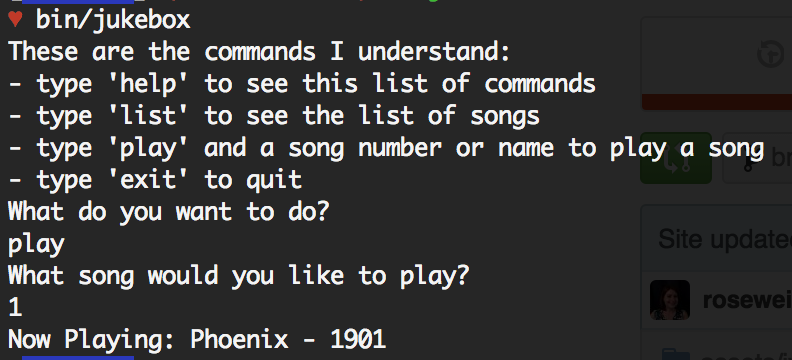
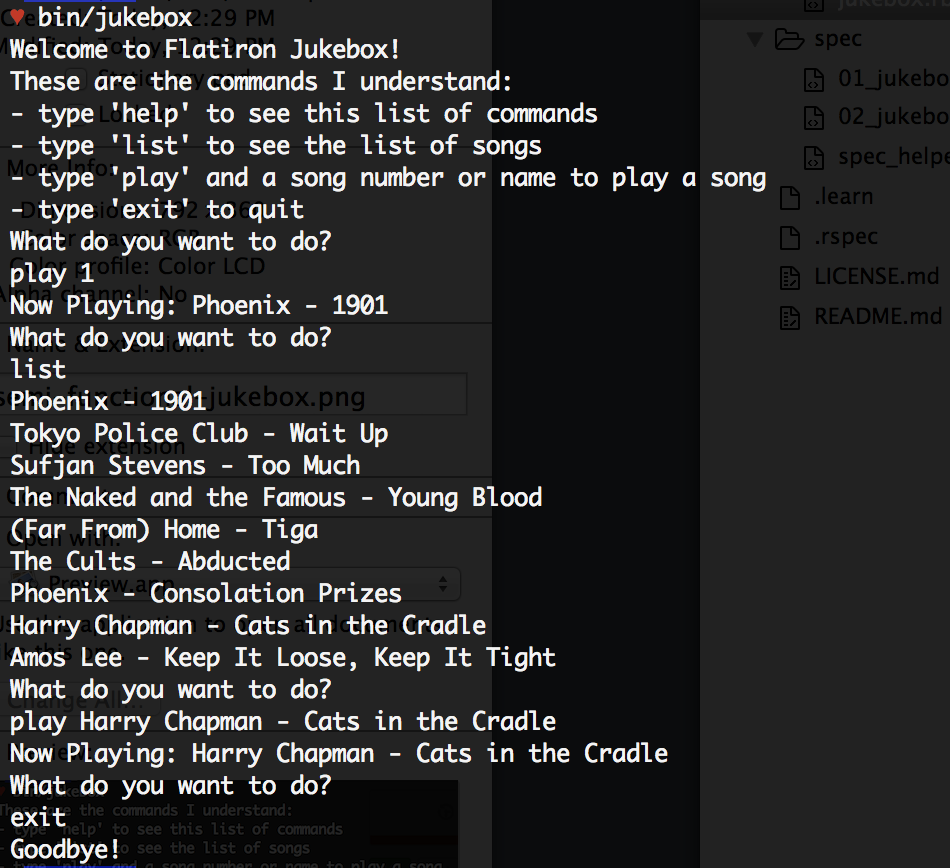

# Guide to Solving and Reviewing OO-Jukebox

## Overview

We are going to create an object oriented jukebox command line interface. It will have all the features of the previous jukebox cli, but instead of writing procedural code we'll be creating a Jukebox class to encapsulate all of the attributes and behaviors that our jukebox will have.

##`spec/01_jukebox_spec.rb`
### 1) Creating a Jukebox class

Our first failure is `NameError: uninitialized constant Jukebox`. Let's define the Jukebox class to make this pass:

In `lib/jukebox.rb`:

```ruby
class Jukebox
end
```

We still have the same number of failures, but now we're getting a different error: `ArgumentError: wrong number of arguments (1 for 0)`. So, the test expected us to be able to pass an argument in when a new Jukebox is initialized. We can see this by looking at how a new Jukebox is being created in `bin/jukebox`: `Jukebox.new(songs)`, where `songs` is an array of strings that have an artist name and a song name separated by ` - `.

To resolve this `ArgumentError`, let's define the initialize method as follows:

```ruby
class Jukebox
  
  def initialize(songs)
  end

end
```

Although the code above seems quite incomplete, it got two tests passing: the `new` method creates new instances of itself, and accepts a list of songs on initialization.

The next failure tells us that `new` assigns the list of songs to an instance variable, so let's do that to make it pass:

```ruby
class Jukebox

  def initialize(songs)
    @songs = songs
  end

end
```

Now every `Jukebox` object will contain a `@songs` attribute that will hold the array that got passed in, and we have the first three tests passing.

### 2) Definining methods that instances of Jukebox respond to

The next failure tells that an instance of Jukebox should respond to a method named `call`. Let's define it as follows:

```ruby
class Jukebox

  def initialize(songs)
    @songs = songs
  end
  
  def call
  end

end
```

We'll come back to this for sure, but for now the next failure is `undefined method 'help' for #<Jukebox:0x007fd4030dab18>`. Let's get this passing:

```ruby
class Jukebox

  def initialize(songs)
    @songs = songs
  end

  def call
  end

  def help
  end

end
```

Since we've already stubbed out these two instance methods, let's go ahead and do the same for the rest of the methods we'll need. According to the spec, the other methods we need are `list` and `play`:


```ruby
class Jukebox

  def initialize(songs)
    @songs = songs
  end

  def call
  end

  def help
  end
  
  def list
  end
  
  def play
  end

end
```

## 3) Building out our methods

### `#help`

The next test tells us that `#help` prints the available commands, specifically expecting the output of the method to include the strings `"help"`, `"list"`, `"play"`, and `"exit"`.

```ruby
class Jukebox

  ...

  def help
    puts "These are the commands I understand:"
    puts "- type 'help' to see this list of commands"
    puts "- type 'list' to see the list of songs"
    puts "- type 'play' and a song number or name to play a song"
    puts "- type 'exit' to quit"
  end

  ...

end
```

### `#list`

The next failure requires us to flesh out the `list` method. Its output should match a regular expression containing the first song in the `@songs` array. It seems reasonable that we should go beyond this failure and have this method print out each of the songs:

```ruby
class Jukebox

  ...
  
  def list
    @songs.each do |song|
      puts song
    end
  end
  
  ...

end
```

### `#play`

Based on the next test, it seems that the `play` method, when called with no arguments, asks the user what song they'd like to play. However, the failure we're getting is that the output should match `/Now Playing: Phoenix - 1901/`. I can infer from this that this method should in fact do three things: 1) ask what song the user would like to play, 2) receive input from the user, 3) play the song the user asked for. 

The line of the spec that says `jukebox.stub(:gets).and_return("1")` tells me that for the sake of this test, a call to `gets` is being stubbed and made to return `"1"`, which is why the artist and name of the first song is expected to be included in the output.

```ruby
class Jukebox

  ...
  
  def play
    puts "What song would you like to play?"
    input = gets.strip
    puts "Now Playing: #{@songs[input.to_i - 1]}"
  end
  
  ...

end
```

This gets the first test for `#play` with no arguments to pass, for the case when a user enters a "human-readable index". We need to also make sure that it also works if the user enters a song name (such as "Phoenix - 1901"). So how can we tell what kind of string the user entered?

If the user enters an "integer string", like `"1"`, calling `.to_i` returns `1`. Chaining `.to_s` onto that would return the exact same thing the user input - `"1"`. If the user enters a "song string", like `"Phoenix - 1901"`, calling `.to_i` on that input will return `0`. So, `input.to_i.to_s == input` is a good test to see what kind of thing the user entered.

```ruby
"1".to_i.to_s == "1"
# => true

"Phoenix - 1901".to_i.to_s == "Phoenix - 1901"
# => false
```

Now we can deal with both cases as follows:

```ruby
class Jukebox

  ...
  
  def play
    puts "What song would you like to play?"
    input = gets.strip
    if input.to_i.to_s == input
      puts "Now Playing: #{@songs[input.to_i - 1]}"
    else
      index = @songs.index(input)
      if index
        puts "Now Playing: #{@songs[index]}"
      end
    end
  end
  
  ...

end
```
#### Accepting an optional argument
Now that both the tests for `#play` with no arguments are passing, let's deal with the case when given a song as an additional argument. The next failure is an `ArgumentError`, because the test is passing an argument to `#play` and the method as we currently defined it does not accept any arguments. Let's fix that:

```ruby
class Jukebox

  ...
  
  def play(song=nil)
    if song
    else
      puts "What song would you like to play?"
      input = gets.strip
      if input.to_i.to_s == input
        puts "Now Playing: #{@songs[input.to_i - 1]}"
      else
        index = @songs.index(input)
        if index
          puts "Now Playing: #{@songs[index]}"
        end
      end
    end
  end
  
  ...

end
```

Since we need our `play` method to work whether an argument is passed in or not, we need to create an optional argument. This can be done by setting the argument to a default value in the method signature. Since we don't want a particular song to play by default, let's just make the default value `nil`. 

We also need an if/else statement: we know the case when no argument was given already passed the test so we'll leave that as it was in the `else` portion (when `song == nil`),  and we'll need some other logic to handle the other case (when an argument got passed in).

Now we're past the `ArgumentError`. We need to handle the case where an argument was passed in (when `song` is not `nil`). The logic for this is basically the same as what we needed for the case without an argument.

```ruby
class Jukebox

  ...
  
  def play(song=nil)
    if song
      if song.to_i.to_s == song
        puts "Now Playing: #{@songs[song.to_i - 1]}"
      else
        index = @songs.index(song)
        if index
          puts "Now Playing: #{@songs[index]}"
        end
      end
    else
      puts "What song would you like to play?"
      input = gets.strip
      if input.to_i.to_s == input
        puts "Now Playing: #{@songs[input.to_i - 1]}"
      else
        index = @songs.index(input)
        if index
          puts "Now Playing: #{@songs[index]}"
        end
      end
    end
  end
  
  ...

end
```

This gets everything in `spec/01_jukebox_spec.rb` passing. But it's not exactly DRY! Let's clean it up. This is the perfect time to use recursion, because if the user does not pass in an argument, after prompting them to choose a song we can simply call the `play` method again, passing in that choice as the argument!

```ruby
class Jukebox

  ...
  
  def play(song=nil)
    if song
      if song.to_i.to_s == song
        puts "Now Playing: #{@songs[song.to_i - 1]}"
      else
        index = @songs.index(song)
        if index
          puts "Now Playing: #{@songs[index]}"
        end
      end
    else
      puts "What song would you like to play?"
      input = gets.strip
      play(input)
    end
  end
  
  ...

end
```

# `spec/02_jukebox_integration_spec.rb`

Now that all the tests for the `Jukebox` model are passing, we'll work on getting the tests for running the cli to pass.

It seems like the only method that we did not build out in the previous part is the `call` method, and that method seems to be getting called in every integration test. So lets figure out what that method needs to do.

If we look at `bin\jukebox`, we see that the `call` method is the last line that executes, thus kicking off the command line interface.

```ruby
jukebox = Jukebox.new(songs)
jukebox.call
```

## Putting it all together: the `call` method

It seems reasonable that we'd put all the methods we created together in some logical order to get our `call` method working. 

If we look specifically at our next failure, we see that the spec is checking that the output of the `help` method is captured when the `call` method is executed.

So this seems like a good place to start:

```ruby
class Jukebox

  ...
  
  def call
    help
  end
  
  ...

end
```

Great. That got us down to 5 failures. Now it seems like the `list` method was supposed to run based on the user inputting the string `'list'` command. (The line of the test that says `jukebox.stub(:gets).and_return('list', 'exit')` is stubbing out this user behavior).

We'll need to accept some user input and execute whatever command they've entered.

```ruby
class Jukebox

  ...
  
  def call
    help
    puts "What do you want to do?"
    input = gets.strip
    if input == "list"
      list
    end
  end
  
  ...

end
```

We've got `help` and `list` covered. Next is play, and the logic is pretty much identical to `list`:

```ruby
class Jukebox

  ...
  
  def call
    help
    puts "What do you want to do?"
    input = gets.strip
    if input == "list"
      list
    elsif input == "play"
      play
    end
  end
  
  ...

end
```

This takes care of `play` with no arguments. To get our case with arguments passing, we need to deal with this more complex user input:

```ruby
class Jukebox

  ...
  
  def call
    help
    puts "What do you want to do?"
    input = gets.strip
    if input == "list"
      list
      
    # IF THE FIRST PART OF THE INPUT IS 'play'
    elsif input.split(" ").first == "play"
      # See if any argument was passed in
      if input.split(" ")[1..-1].empty?
        # if there's no argument, just call the play method
        play
      else
        # if there's an argument, pass it to the play method
        play(input.split(" ")[1..-1].join(" "))
      end
    end
    
  end
  
  ...

end
```

This gets all of our tests passing!

# Going beyond the test suite: making our program behave the way we want!

So, our program passes the tests, but the real goal of programming is to build things that are actually usable. Let's run `bin/jukebox` to witness the current behavior of our jukebox. _Note: (If you get an error involving permissions when you try to execute the bin file, [use `chmod` to fix it](http://ss64.com/bash/chmod.html)._



After the song plays, the program simply stops. In fact, it stops after any command that we enter. This is not the behavior we want.

As it turns out, we never really made the 'exit' command meaningful up to this point. What we should probably do is create some kind of loop that will keep the program going until someone types 'exit'. Until then, we should execute whatever command they entered and then just ask what they want to do and get their input again. We may also want to add some kind of 'welcome' and 'goodbye' messages to signal the start and end of the program:

```ruby
class Jukebox

  ...
  
  def call
    puts "Welcome to Flatiron Jukebox!"
    
    help

    input = nil

    while input != 'exit'
      puts "What do you want to do?"
      input = gets.strip
      if input == "list"
        list
      elsif input.split(" ").first == "play"
        if input.split(" ")[1..-1].empty?
          play
        else
          play(input.split(" ")[1..-1].join(" "))
        end
      elsif input == 'exit'
        puts 'Goodbye!'
      end
    end
  end
  
  ...

end
```

Now we have the functionality we want:



# Refactoring

The `call` method works the way we want it to, but it's a little bit messy and long. We can refactor it by creating helper methods that respect the single responsibility principle!

Here's our Jukebox class with a little bit of refactoring:

```ruby
class Jukebox

  def initialize(songs)
    @songs = songs
  end

  def call
    jukebox_intro

    input = nil

    while input != 'exit'
      input = get_input
      if input == "list"
        list
      elsif input.split(" ").first == "play" 
        # This means an empty string gets passed to the play method if the user didn't enter any song, so the play method needed a small tweak to make this work.
        play(input.split(" ")[1..-1].join(" "))
      elsif input == 'exit'
        exit
      end
    end
  end

  def jukebox_intro
    puts "Welcome to Flatiron Jukebox!"
    help
  end

  def get_input
    puts "What do you want to do?"
    gets.strip
  end

  def exit
    puts 'Goodbye!'
  end

  def help
    puts "These are the commands I understand:"
    puts "- type 'help' to see this list of commands"
    puts "- type 'list' to see the list of songs"
    puts "- type 'play' and a song number or name to play a song"
    puts "- type 'exit' to quit"
  end
  
  def list
    @songs.each do |song|
      puts song
    end
  end
  
  def play(song=nil)
    # Checking for the empty string to make our refactored call method work
    if song && song != ""
      if song.to_i.to_s == song
        puts "Now Playing: #{@songs[song.to_i - 1]}"
      else
        index = @songs.index(song)
        if index
          puts "Now Playing: #{@songs[index]}"
        end
      end
    else
      puts "What song would you like to play?"
      input = gets.strip
      play(input)
    end
  end

end
```

There's definitely more refactoring that could be done, and more functionality that can be built out - feel free to take this as far as you want! Happy coding :)
